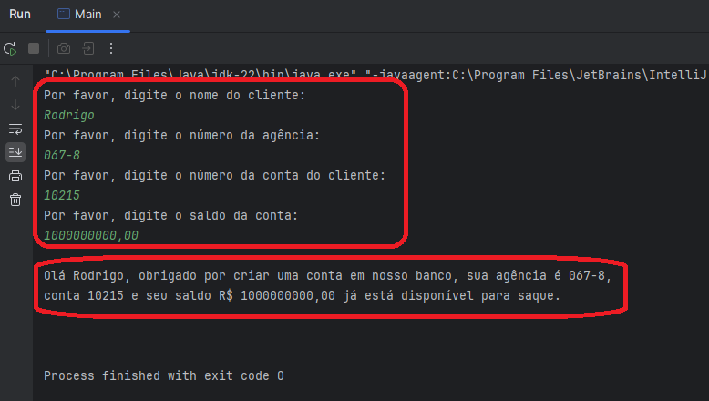

# DIO - Trilha Java Básico (Santander 2024 - Backend com Java) -> Solução

www.dio.me

#### Autor

- [Rodrigo Duarte](https://github.com/rodrigoduartesilva)

## Sintaxe - Desafio

Exercitando todo o conteúdo apresentado no módulo de Sintaxe codificando o seguinte cenário.

1. Criei um projeto `ContaBanco` que receberá dados via terminal contendo as características de conta em banco conforme atributos abaixo;
2. Dentro do projeto, criei a classe `ContaTerminal.java` para realizar toda a codificação da aplicação;
3. Finalmente, instanciei a classe ContaTerminal na classe Main,passando os dados solicitados via a classe Scanner.

###### Atributos e seus respectivos tipos

| Atributo     | Tipo    | Exemplo       |
| ------------ | ------- | ------------- |
| Numero       | Inteiro | 1021          |
| Agencia      | Texto   | 067-8         |
| Nome Cliente | Texto   | MARIO ANDRADE |
| Saldo        | Decimal | 237.48        |

###### Saída via terminal (Atenção: aplicação desenvolvida na IDE IntelliJ)

2. Os dados serão inseridos via terminal, sendo que o usuário receberá uma mensagem informando qual dado ele deverá digitar via teclado, exemplo:

- Programa: "Por favor, digite o número da Agência: "
- Usuário: 1021 _(depois ENTER para o próximo campo)_

###### A mensagem será exibida via terminal de acordo com mostrado abaixo

3. Depois de todas as informações terem sido inseridas, o sistema deverá exibir a seguinte mensagem:

_"Olá [Nome Cliente], obrigado por criar uma conta em nosso banco, sua agência é [Agencia], conta [Numero] e seu saldo [Saldo] já está disponível para saque"._

->Exemplo no termninal

